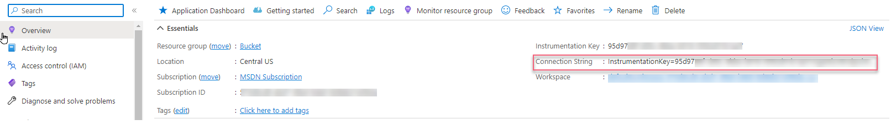

# Objective

To demonstrate how to enable telemetry delivery to Azure Application Insights with a containerized Java application. This document demonstrates the creation of an assembly file to instruct Maven to build a zip file with the necessary project file, modify the pom.xml file with the required publish settings, and create the Dockerfile essential to the creation of the container image. Finally, to tie everything together, an explanation of how to run and test the process locally.

To get this example to work, you need to install an IDE such as [IntelliJ from JetBrains](https://www.jetbrains.com/idea/download/) and [Docker for Desktop](https://www.docker.com/products/docker-desktop/)

# Assembly File
The Assembly Plugin for Maven enables developers to combine project output into a single distributable archive. For example, assume that a Maven project defines a single JAR artifact that contains both a console application and a Swing application. Such a project could define two "assemblies" that bundle the application with a different set of supporting scripts and dependency sets. One assembly would be the assembly for the console application, and the other could be a Swing application bundled with a slightly different set of dependencies. This assembly aims to package the project-generated JAR file and the AppInsights JAR file into a single Zip file.
````xml
<assembly xmlns="http://maven.apache.org/ASSEMBLY/2.1.0"
          xmlns:xsi="http://www.w3.org/2001/XMLSchema-instance"
          xsi:schemaLocation="http://maven.apache.org/ASSEMBLY/2.1.0 http://maven.apache.org/xsd/assembly-2.1.0.xsd">
    <id>azure-app-service</id>
    <formats>
        <format>zip</format>
    </formats>
    <includeBaseDirectory>false</includeBaseDirectory> <!-- no root folder for the zip file-->
    <fileSets>
        <fileSet>
            <directory>${project.build.directory}</directory>
            <outputDirectory>.</outputDirectory> <!-- don't include target as a folder -->
            <includes>
                <include>app.jar</include>
                <include>resources/*</include>
            </includes>
        </fileSet>
    </fileSets>
</assembly>
````
# Pom file Additions

Two plug-ins needed to be added to the POM file. One is to copy the _applicationinsights-agent-3.4.1.jar_ into the resource directory, and the other is to 

````xml
<plugin>
    <groupId>org.apache.maven.plugins</groupId>
    <artifactId>maven-dependency-plugin</artifactId>
    <version>3.1.1</version>
    <executions>
        <execution>
            <id>copy-agent</id>
            <phase>package</phase>
            <goals>
                <goal>copy</goal>
            </goals>
        </execution>
    </executions>
    <configuration>
        <artifactItems>
            <artifactItem>
                <groupId>com.microsoft.azure</groupId>
                <artifactId>applicationinsights-agent</artifactId>
                <version>${app.insights.version}</version>
                <type>jar</type>
                <overWrite>false</overWrite>
            </artifactItem>
        </artifactItems>
        <outputDirectory>${project.build.directory}/resources</outputDirectory>
        <overWriteReleases>false</overWriteReleases>
        <overWriteSnapshots>true</overWriteSnapshots>
    </configuration>
</plugin>
````

Create the zip file based on the zip-assembly file.

````xml
<plugin>
    <artifactId>maven-assembly-plugin</artifactId>
    <version>3.3.0</version>
    <configuration>
        <appendAssemblyId>false</appendAssemblyId>
        <finalName>${project.artifactId}</finalName>
        <descriptors>
            <descriptor>src/main/assembly/zip-assembly.xml</descriptor>
        </descriptors>
    </configuration>
    <executions>
        <execution>
            <id>create-zip</id>
            <phase>package</phase>
            <goals>
                <goal>
                    single
                </goal>
            </goals>
        </execution>
    </executions>
</plugin>
````

# Docker File


Adding Four goals to the Docker file base on the openjdk:17-alpine image:

1. Install the zip package into the container
2. Copy the AppInsightsAgentAssembly.zip into the container
3. Unzip the file
4. Add a command line argument to refer to the jar file on startup


````dockerfile
FROM openjdk:17-alpine

WORKDIR /app

RUN apk update

RUN apk add zip

COPY ./target/AppInsightsAgentAssembly.zip /app

RUN unzip AppInsightsAgentAssembly.zip

CMD ["java","-javaagent:./resources/applicationinsights-agent-3.4.1.jar","-jar","app.jar"]
````

# Bringing it all together

1. Create an instance of Application Insights in Azure and retrieve the connection string



Retrieve the code from here:
[GitHub URL]

1. Open the code in your favorite editor and run the Maven Package action. The zip file should now be in your target folder.
2. Create a file named .env and add the Application Insights connection string as an environment variable.

Environment File:

````bash
#Connection String
APPLICATIONINSIGHTS\_CONNECTION\_STRING=InstrumentationKey=XXXXXXX-XXXX-XXXX-XXXX-XXXXXXXX;IngestionEndpoint=https://XXXXXXXX.in.applicationinsights.azure.com/;LiveEndpoint=https://XXXXXXXXX.livediagnostics.monitor.azure.com/
````

1. Create the container image:

docker build . -t myimage:latest

1. Start the container and reference the environment file in the docker run command

docker run -it -p 8080:8080 --env-file=.env myimage:latest

1. Call the API with the following URL:

[http://localhost:8080/api/hello](http://localhost:8080/api/hello)

1. Telemetry should be available in your instance of Application Insights:


# Final Thoughts

Detailed information on the [Java In-Process Agent](https://learn.microsoft.com/en-us/azure/azure-monitor/app/java-in-process-agent) from Microsoft is found on their website, and to download the source code, visit our GitHub site.